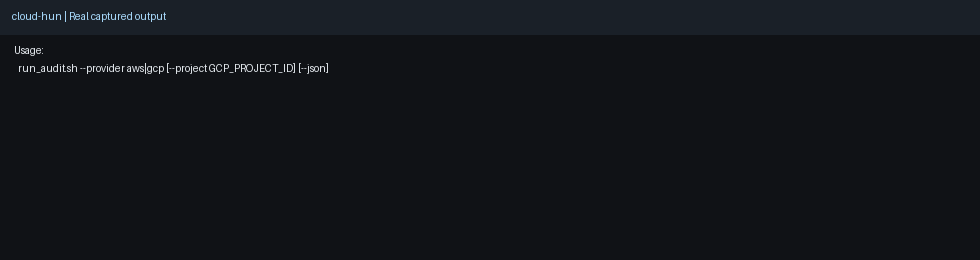
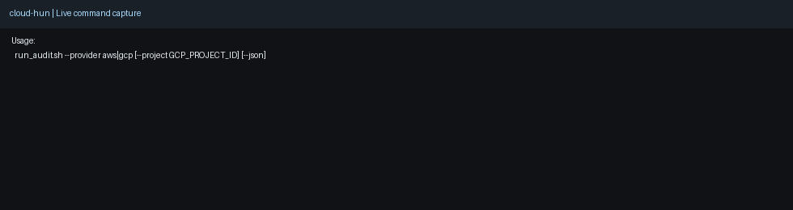

# cloud-hun

A cloud exposure and misconfiguration hunting toolkit for practical defensive operations.

## Why this project

- **Impact:** Improves visibility into cloud identity and exposure risks.
- **Scale:** Works in repeatable CLI workflows for AWS and GCP environments.
- **Use case:** IAM hygiene audits, external exposure detection, and controlled remediation planning.

## Demo media

- Screenshot: 
- Demo GIF: 

## Capability snapshot

- IAM posture checks for AWS and GCP
- Public exposure scanning with JSON support
- Plan-first remediation workflow for controlled hardening

## Focus areas

1. **Identity hygiene**
   - IAM and account posture checks
2. **External attack surface**
   - Public buckets, public compute, exposed APIs
3. **Misconfiguration remediation support**
   - Safe hardening helpers for lab and controlled environments

## Included components

- `scripts/aws_iam_audit.sh` – AWS account and IAM hygiene checks
- `scripts/gcp_iam_audit.sh` – GCP IAM posture checks
- `scripts/public_exposure_scan.py` – AWS exposure scan with text or JSON output
- `scripts/fix.sh` – controlled AWS hardening helper (`--plan` or `--apply`)
- `scripts/run_audit.sh` – single entrypoint wrapper
- `scripts/qa_check.sh` – syntax and lint checks
- `docs/` – attack paths, misconfig library, and lab setup

## Quick start

```bash
git clone https://github.com/FoxSecIntel/cloud-hun.git
cd cloud-hun
```

Run AWS IAM audit:

```bash
chmod +x scripts/aws_iam_audit.sh
./scripts/aws_iam_audit.sh
```

Run exposure scan:

```bash
python3 scripts/public_exposure_scan.py
python3 scripts/public_exposure_scan.py --json
```

Run GCP IAM audit:

```bash
./scripts/gcp_iam_audit.sh YOUR_PROJECT_ID
```

Run unified wrapper:

```bash
./scripts/run_audit.sh --provider aws
./scripts/run_audit.sh --provider gcp --project YOUR_PROJECT_ID
```

## Safe remediation workflow

```bash
# Show actions only
./scripts/fix.sh --plan

# Execute actions
./scripts/fix.sh --apply
```

## Requirements

- AWS CLI v2 configured for AWS scripts
- gcloud CLI configured for GCP scripts
- Python 3.8+
- Optional: `jq`, `shellcheck`

## Security notes

- Use read-only identities for audit collection where possible.
- Run remediation only with explicit approval and change control.
- Validate impact in test or lab accounts before production.

## Quick Demo

```bash
# 1) Run a core check
# 2) Request JSON output
# 3) Pipe into jq for analyst workflows
```

